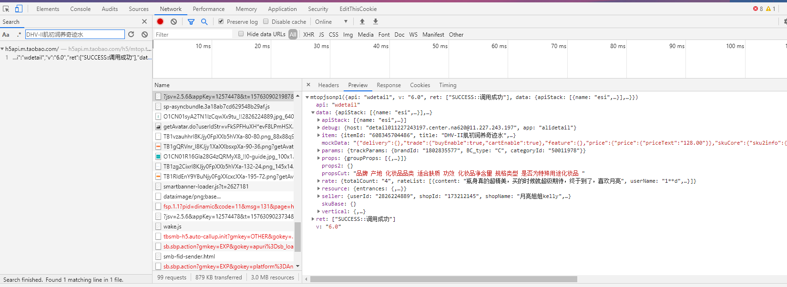

### 淘宝h5 商品详情爬虫

以这个商品为例

请求参数只需要id就可以了

https://h5.m.taobao.com/awp/core/detail.htm?id=608345704486

搜索商品名就找到接口了

data参数解码结果

{"id":"608345704486","itemNumId":"608345704486","itemId":"608345704486","exParams":"{\"id\":\"608345704486\"}","detail_v":"8.0.0","utdid":"1"}

那么只要找到sign生成方法就可以伪造请求了（其实只需要data参数就能请求到数据了，还是伪装一下吧）

把cookie都清了 

试一下就出来了。

#### 分布式爬取

要爬取的商品链链接已经存在mysql数据库了，从mysql取出商品链接放入redis就好了。

重写 make_request_from_data 构造请求。

自我感觉写入mysql管道 设计的很通用，如果你也觉得有参考价值请给我小星星

item字段和mysql字段一致，根据item类名动态选择数据表，动态选择查询过滤字段动态决定记录存在是否更新；支持ItemLoader；批量写入。

# h5端 接口不能使用云服务器ip，没法部署好狠啊

为什么在网上没看到其他人说这个问题？还是解决了，求帮忙！！！